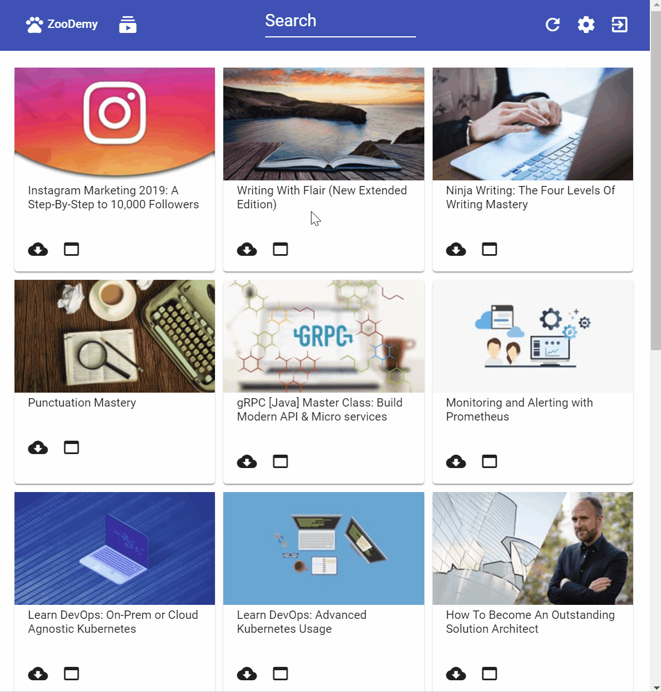

# ZooDemy

A minimalistic Udemy offline courses downloader and player. Built on Electron, Angular and Material for frontend.

## Downloads:

| Platform | Link|
| --- | --- |
| Windows | [Download](https://github.com/alexcibotari/zoodemy/releases/download/0.2.0/ZooDemy.Setup.0.2.0.exe)|
| Mac | [Download](https://github.com/alexcibotari/zoodemy/releases/download/0.2.0/ZooDemy-0.2.0-mac.zip)|
| Linux | [Download](https://github.com/alexcibotari/zoodemy/releases/download/0.2.0/ZooDemy.0.2.0.AppImage)|

## Features

- Display subscribed course
  - Video
  - Article
  - Quiz
- Download subscribed course
  - Progress bar
  - Retry to download course after network issues 
  - Continue to download lecture after network issues
  - Assets:
    - Video
    - Video Mashup ( Video with presentation)
    - Additional Assets
    - Articles
    - E-Book
- Settings
  - Change app home folder

## Future Features

- Download subscribed course
  - Assets:
    - Quiz
    - Subtitles
    - External links
- Settings
  - Choose preferred video resolution (AUTO - Highest possible)
  - Additional Assets
  - Subtitles
- Multi language (Only English at the moment)
  
Please let me know about your preferable features.

## Developers

- Run locally ``npm run electron``.
- Debug locally. Open two consoles in first run ``npm run build:watch`` and wait until build ends, in second console run ``npm run electron:dev``.

## For personal use only
Do not share courses downloaded with the application, it is for personal use only.
Please read Udemy Terms of Use
